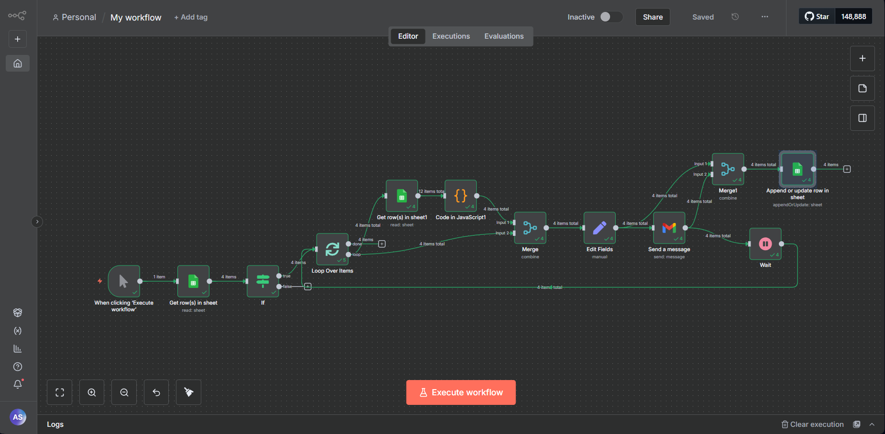
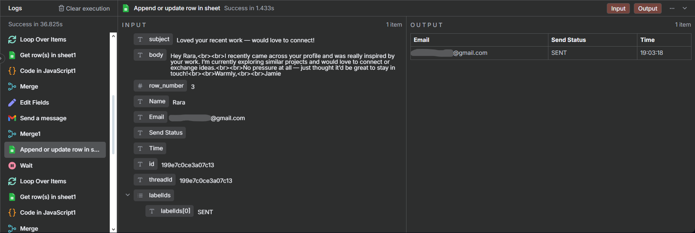
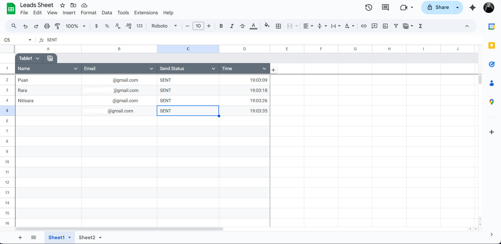
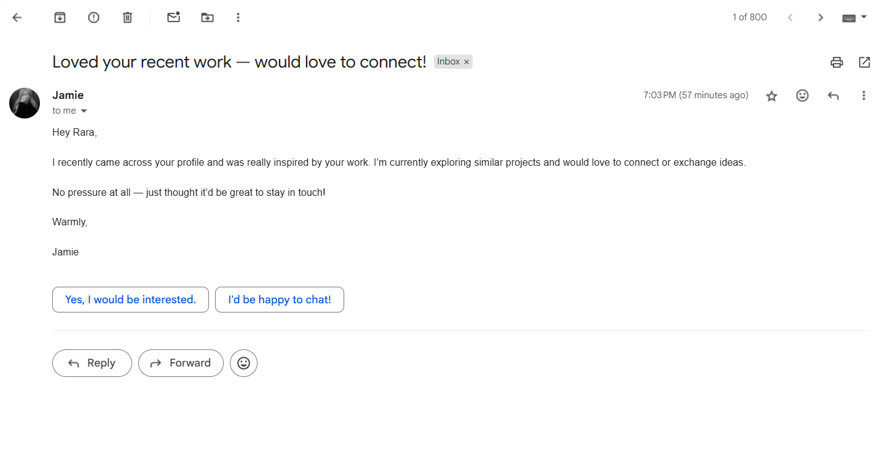

# Cold Email Automation

This project automates personalized cold emails using Gmail and Google Sheets via n8n workflow automation.

## 🚀 Features

- Sends customized cold emails automatically.
- Pulls recipient data (Name and Email) from Google Sheets.
- Logs sent emails with status and timestamp to Google Sheets as a report.

## 🧰 Tech Stack

- n8n (workflow automation)
- Google Sheets API
- Gmail API
- Google Drive API
- Node.js environment (local)

## 🧠 How It Works

1. Google Sheets contains contact info (name, email, etc.)
2. n8n workflow reads the data.
3. Function node generates the email content.
4. Gmail node sends the email automatically.
5. The workflow updates the sheet with send status and timestamp.

## 📸 Screenshots

- Workflow Overview
  
- Execution and Data Logs
  
- Google Sheets Data Report
  
  - Sent Email Screenshot
    

## 🧩 Workflow File

You can import the workflow using [my-workflow.json](./my-workflow.json) file.
